# osTicket Help Desk Deployment in Microsoft Azure

## Project Overview

This project documents my deployment of **osTicket**, an open-source help desk ticketing platform, inside a **Windows 10 virtual machine hosted in Microsoft Azure**.

Rather than treating the exercise as only a software installation, I used the lab to practice the type of work an entry-level IT Support or Help Desk technician may encounter: provisioning a cloud VM, connecting through Remote Desktop, enabling Windows server components, configuring IIS and PHP, preparing a MySQL database, deploying a web application, resolving prerequisite issues, and validating both the technician and end-user portals.

> **Project focus:** Build a working help desk application from the infrastructure layer up, then verify that the environment is ready for ticketing workflows.

---

## Skills Demonstrated

- Microsoft Azure virtual machine deployment
- Windows 10 administration
- Remote Desktop Protocol (RDP)
- Internet Information Services (IIS)
- CGI and PHP integration
- PHP Manager for IIS
- MySQL database setup
- HeidiSQL database administration
- osTicket deployment and validation
- Windows file-system navigation and permissions
- Web application troubleshooting
- Dependency and prerequisite validation

---

## Lab Architecture

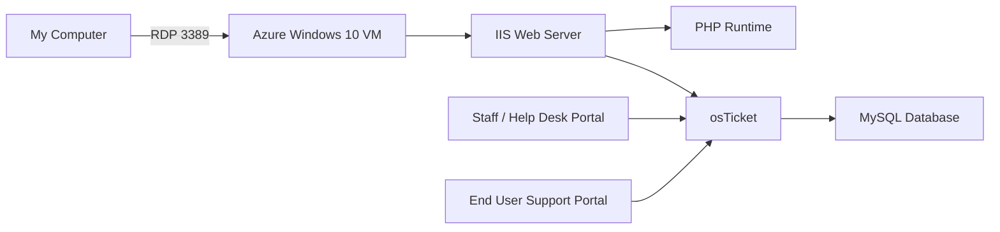

---

## Environment and Technologies

| Component | Lab Use |
|---|---|
| Microsoft Azure | Hosted the Windows virtual machine |
| Windows 10 Enterprise | Operating system for the osTicket server |
| RDP | Remote administration of the VM |
| IIS | Hosted the osTicket web application |
| CGI | Enabled PHP processing through IIS |
| PHP 7.3.8 NTS | Application runtime used in the lab |
| PHP Manager for IIS | Registered and managed PHP in IIS |
| MySQL 5.5.62 | Database backend |
| HeidiSQL | Created and managed the osTicket database |
| osTicket v1.15.8 | Help desk ticketing application |

---

# Implementation

## Phase 1 — Provision the Azure VM

I created a Windows 10 virtual machine in Microsoft Azure to serve as the host for the help desk environment. I named the VM `osticket-vm`, selected a Windows 10 Enterprise image, used an x64 architecture, and selected a VM size with **4 vCPUs**.

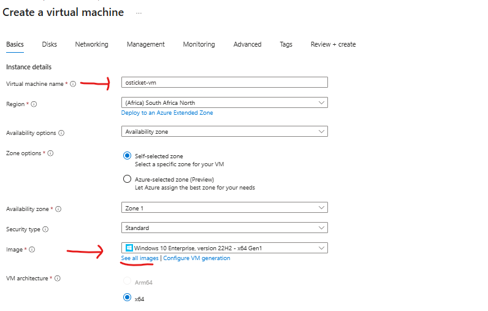

I configured a lab administrator account and enabled **RDP (3389)** so I could manage the machine remotely.

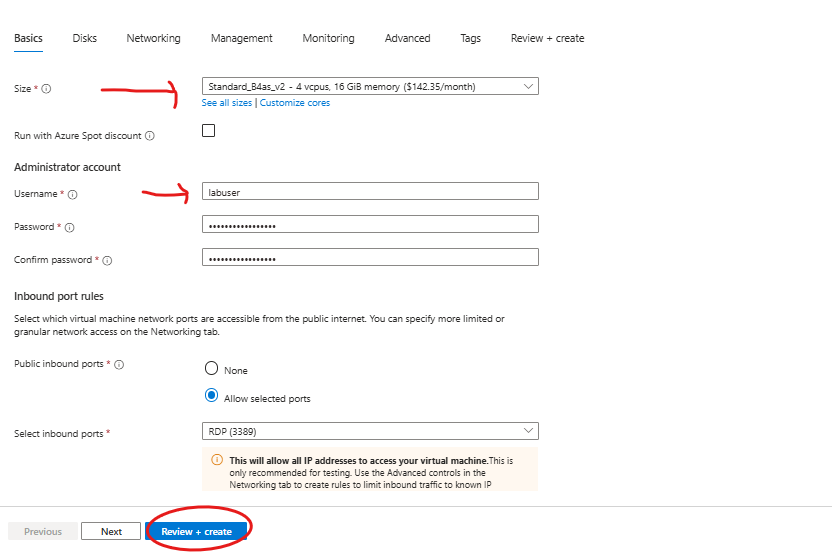

After deployment, I opened the VM resource in Azure and confirmed that the machine was running before connecting to it.

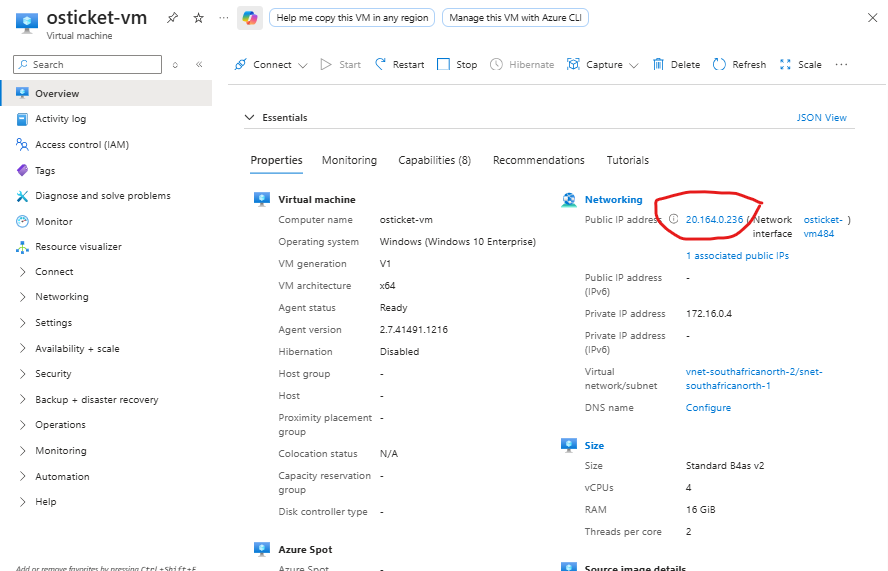

> **Security note:** Public IP addresses and lab credentials should be treated as temporary lab data. For a public portfolio, redact any address or credential that is still active.

---

## Phase 2 — Connect with Remote Desktop

I used the VM's public IP address to establish a Remote Desktop session from my local computer.

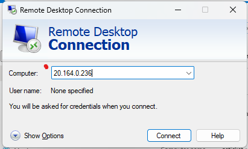

This gave me administrative access to the Windows environment where the rest of the installation was completed.

---

## Phase 3 — Prepare Windows and IIS

Before installing osTicket, I enabled **Internet Information Services (IIS)** through Windows Features. Under **World Wide Web Services → Application Development Features**, I also enabled **CGI**, which is required for the PHP configuration used in this lab.

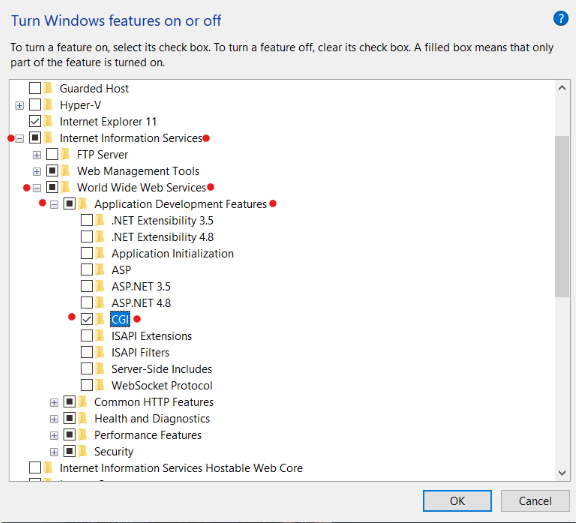

I then installed the supporting IIS components used by the lab, including **PHP Manager for IIS** and the **IIS Rewrite Module**.

After installation, PHP Manager appeared inside IIS Manager.

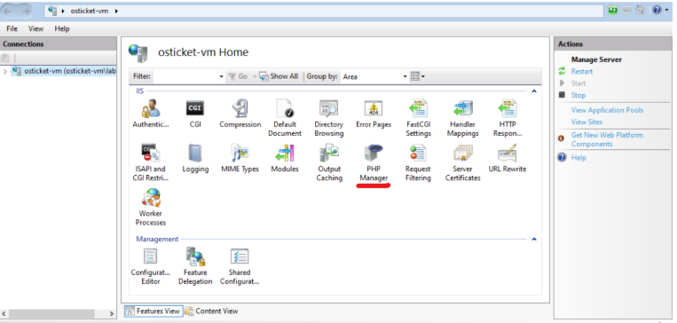

---

## Phase 4 — Install and Register PHP

I created a dedicated PHP directory at:

```text
C:\PHP
```

I extracted the PHP runtime into that directory, installed the required Visual C++ runtime, and then registered PHP with IIS by pointing PHP Manager to:

```text
C:\PHP\php-cgi.exe
```

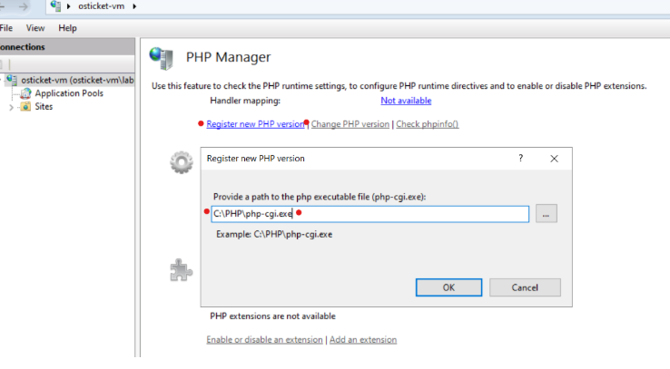

After registering PHP, I restarted IIS so the new runtime configuration could be loaded.

---

## Phase 5 — Deploy osTicket to IIS

I extracted the osTicket installation package and copied the application `upload` folder into the IIS web root:

```text
C:\inetpub\wwwroot
```

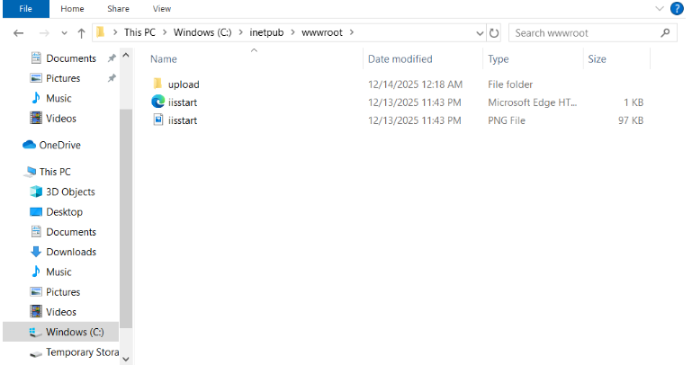

I then renamed the folder from:

```text
upload
```

to:

```text
osTicket
```

so the application could be accessed through a clearer URL path.

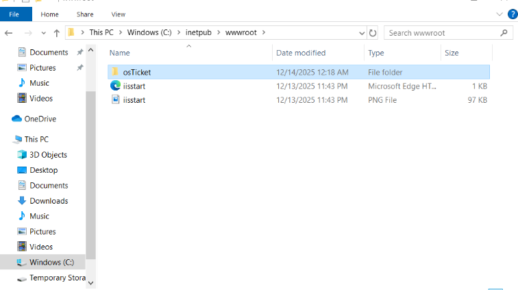

I restarted IIS again before browsing to the application.

---

## Phase 6 — Resolve osTicket Prerequisites

When I first opened the osTicket installer, the prerequisite screen showed that several recommended PHP extensions were not yet enabled.

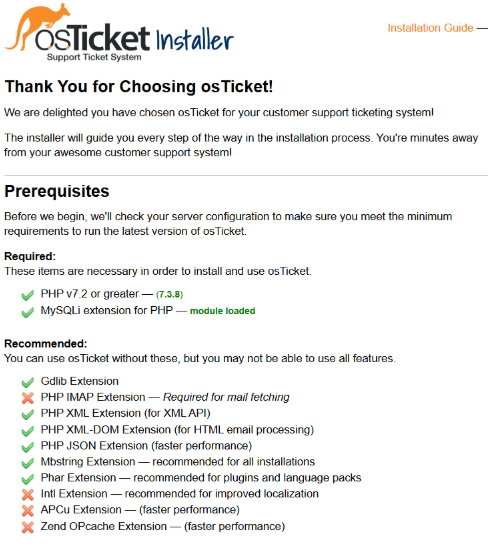

Instead of continuing with an incomplete configuration, I returned to **IIS → PHP Manager → PHP Extensions** and enabled the extensions required by the lab, including:

```text
php_imap.dll
php_intl.dll
php_opcache.dll
```

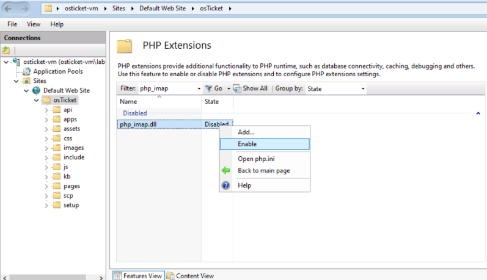

After refreshing the installer, the prerequisite screen showed the improved PHP configuration.

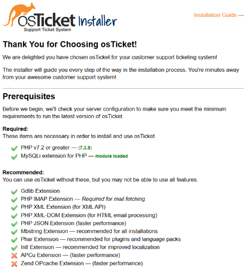

### Troubleshooting takeaway

This was a useful example of **dependency troubleshooting**:

1. Observe the application's prerequisite check.
2. Identify the missing dependency.
3. Return to the server configuration.
4. Enable the required component.
5. Refresh and verify the result.

That same troubleshooting pattern applies to many help desk and application-support situations.

---

## Phase 7 — Prepare the osTicket Configuration

I renamed the sample osTicket configuration file:

```text
C:\inetpub\wwwroot\osTicket\include\ost-sampleconfig.php
```

to:

```text
C:\inetpub\wwwroot\osTicket\include\ost-config.php
```

I then adjusted the file permissions required by the installer so the application could write its configuration during setup.

> **Production note:** Broad permissions such as `Everyone: Full Control` should not be left in place in a real production environment. The lab uses simplified permissions to complete the installer; production permissions should follow least-privilege practices.

---

## Phase 8 — Create the MySQL Database

I installed **MySQL 5.5.62** and used **HeidiSQL** as the database client.

Inside HeidiSQL, I connected to the local MySQL instance and created a database named:

```text
osTicket
```

I then supplied the database name and lab database credentials to the osTicket web installer.


---

## Phase 9 — Complete the Web Installation

After the web server, PHP runtime, application files, and database were ready, I completed the osTicket installation through the browser.

The completed application exposed two different interfaces:

### Staff / Help Desk Portal

This is the technician-facing interface used by support personnel to work tickets and administer the help desk.

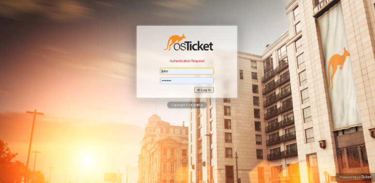

### End User Support Portal

This is the customer-facing interface where users can create and track support requests.

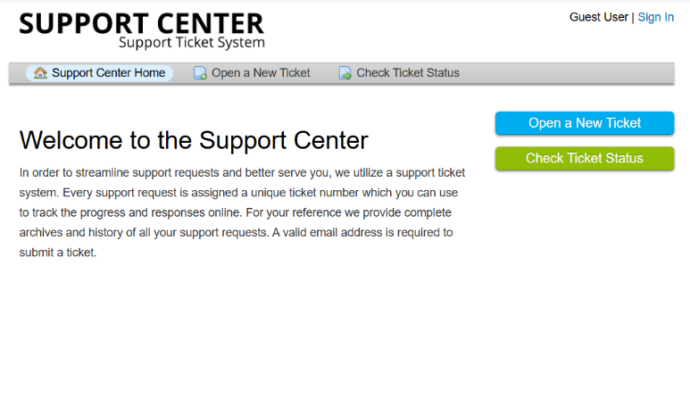

---

# Validation

I considered the installation successful after verifying that:

- the Azure VM was operational;
- RDP access worked;
- IIS was running;
- PHP was registered with IIS;
- the osTicket application loaded in the browser;
- required PHP extensions were enabled;
- the MySQL database connection completed successfully;
- the **Staff Control Panel** loaded; and
- the **End User Support Center** loaded.

The two local application paths used during validation were:

```text
Staff portal:
http://localhost/osTicket/scp/login.php

End-user portal:
http://localhost/osTicket/
```

---

# Troubleshooting and Lessons Learned

## 1. Application problems can originate below the application layer

The osTicket installer initially reported missing PHP extensions. The application itself was present, but the supporting runtime configuration was incomplete. This reinforced the importance of checking dependencies before assuming the application is defective.

## 2. Restarting a service can be part of applying configuration

After registering PHP and deploying osTicket, I restarted IIS so the service would load the updated configuration.

## 3. Validation should happen after every major change

I repeatedly checked the environment after making configuration changes instead of waiting until the end of the installation. This made it easier to identify where a problem was introduced.

## 4. Credentials and permissions deserve special attention

Lab environments often use simplified credentials and permissions for repeatability. In a real environment, I would use stronger credential-management practices and the principle of least privilege.

## 5. A help desk platform has both technician and customer perspectives

Validating both the staff portal and the end-user portal helped me understand that ticketing systems support two different workflows: **users requesting help** and **support teams managing that work**.

---

# What I Practiced From an IT Support Perspective

This project gave me hands-on practice with the type of troubleshooting sequence I want to carry into Help Desk work:

```text
Identify the symptom
        ↓
Determine the affected layer
        ↓
Check configuration and dependencies
        ↓
Make one controlled change
        ↓
Restart/reload when required
        ↓
Test again
        ↓
Document the result
```

It also reinforced that a ticketing platform is not only an application. It depends on the underlying **operating system, network connectivity, web server, runtime, database, file permissions, and user access** all working together.

---

# Project Outcome

By the end of the lab, I had deployed a functional osTicket help desk environment on a Windows 10 Azure VM and validated both the **staff-facing** and **customer-facing** interfaces.

This installation serves as the foundation for the next stages of the project:

1. **Post-Installation Configuration**
2. **Ticket Lifecycle and Help Desk Workflow**

---

## Documentation Note

This README was written from my own lab experience and screenshots. The technical installation sequence follows the course/lab procedure I used to build the environment, while the documentation, organization, explanations, troubleshooting notes, and screenshots in this repository are my own.
